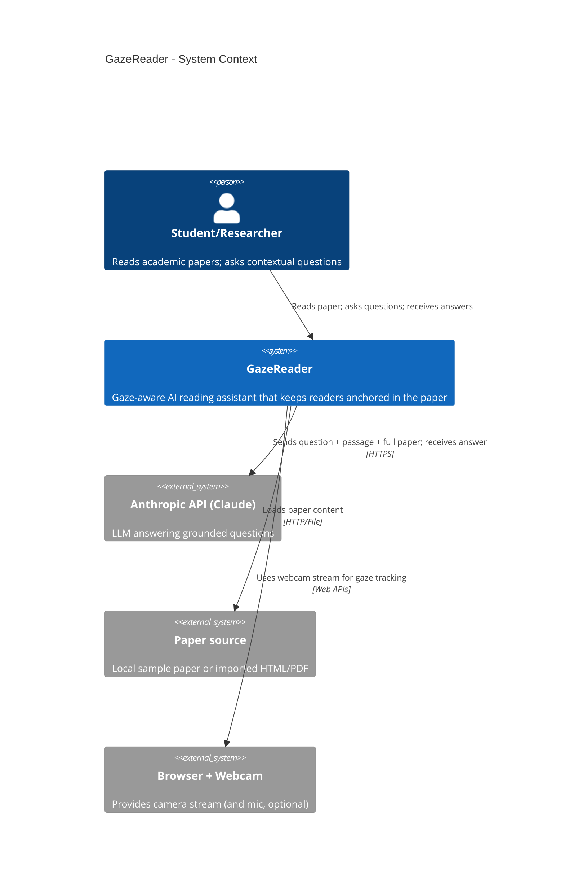
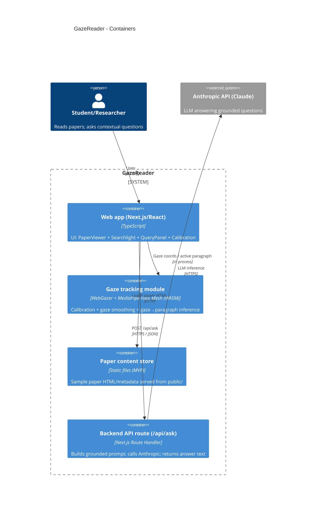

# Architecture (C4 diagrams)

## C4 context

```mermaid
C4Context
title GazeReader - System Context

Person(Researcher, "Student/Researcher", "Reads academic papers; asks contextual questions")

System(GazeReader, "GazeReader", "Gaze-aware AI reading assistant that keeps readers anchored in the paper")

System_Ext(AnthropicAPI, "Anthropic API (Claude)", "LLM answering grounded questions")
System_Ext(PaperSource, "Paper source", "Local sample paper or imported HTML/PDF")
System_Ext(BrowserWebcam, "Browser + Webcam", "Provides camera stream (and mic, optional)")

Rel(Researcher, GazeReader, "Reads paper; asks questions; receives answers")
Rel(GazeReader, BrowserWebcam, "Uses webcam stream for gaze tracking", "Web APIs")
Rel(GazeReader, PaperSource, "Loads paper content", "HTTP/File")
Rel(GazeReader, AnthropicAPI, "Sends question + passage + full paper; receives answer", "HTTPS")
```

## C4 container

```mermaid
C4Container
title GazeReader - Containers

Person(Researcher, "Student/Researcher", "Reads papers; asks contextual questions")

System_Ext(AnthropicAPI, "Anthropic API (Claude)", "LLM answering grounded questions")

System_Boundary(GazeReaderBoundary, "GazeReader") {
  Container(WebFrontend, "Web app (Next.js/React)", "TypeScript", "UI: PaperViewer + Searchlight + QueryPanel + Calibration")
  Container(GazeTracking, "Gaze tracking module", "WebGazer + MediaPipe Face Mesh (WASM)", "Calibration + gaze smoothing + gaze→paragraph inference")
  Container(PaperContent, "Paper content store", "Static files (MVP)", "Sample paper HTML/metadata served from public/")
  Container(ApiRouteAsk, "Backend API route (/api/ask)", "Next.js Route Handler", "Builds grounded prompt; calls Anthropic; returns answer text")
}

Rel(Researcher, WebFrontend, "Uses", "HTTPS")
Rel(WebFrontend, GazeTracking, "Gaze coords / active paragraph", "in-process")
Rel(WebFrontend, PaperContent, "Loads paper HTML", "HTTP")
Rel(WebFrontend, ApiRouteAsk, "POST /api/ask", "HTTPS / JSON")
Rel(ApiRouteAsk, AnthropicAPI, "LLM inference", "HTTPS")

UpdateLayoutConfig($c4ShapeInRow="2", $c4BoundaryInRow="1")

UpdateRelStyle(WebFrontend, GazeTracking, $offsetY="-10")
UpdateRelStyle(WebFrontend, ApiRouteAsk, $offsetX="-30", $offsetY="-10")
UpdateRelStyle(WebFrontend, PaperContent, $offsetX="-20")
UpdateRelStyle(ApiRouteAsk, AnthropicAPI, $offsetX="-20")
```
