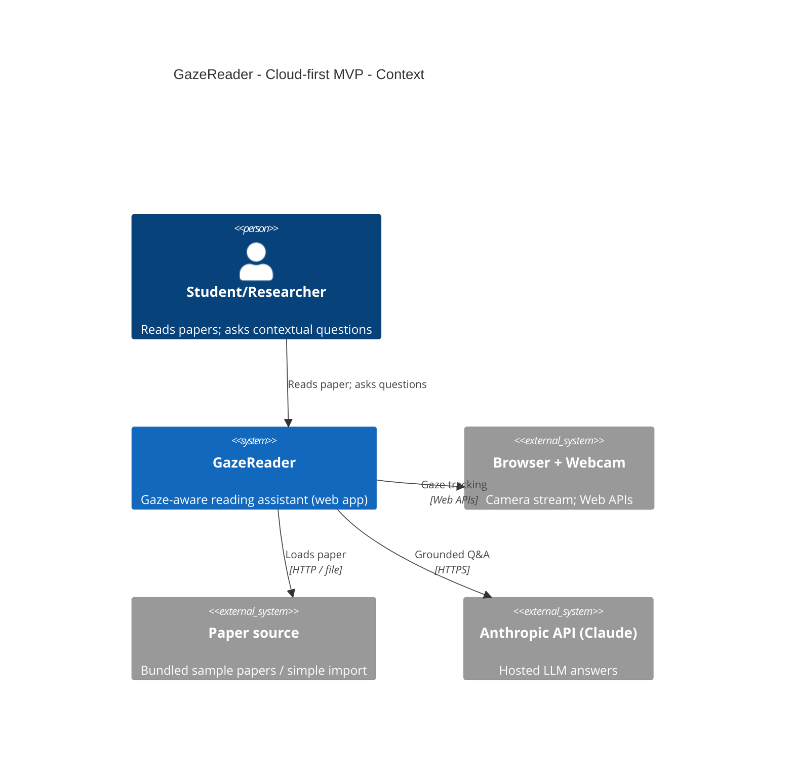
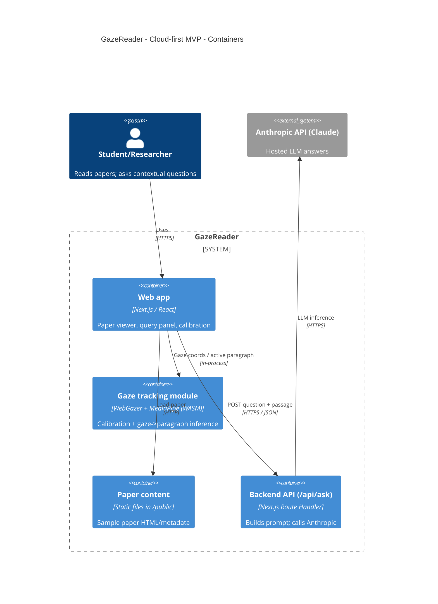

# Architecture: Cloud-first MVP monolith

GazeReader is built as a single Next.js application that talks to a hosted LLM (Claude via the Anthropic API) for grounded question answering. This is the fastest path to a working demo and keeps ops minimal.

## C4 context

## C4 container

## Assumptions

- Users are online and okay with passages + paper text being sent to a hosted LLM.
- Paper library stays small/static for the MVP; PDF ingestion is out of scope.
- One Next.js deployment (Vercel-class) is the whole backend.

## Trade-offs

- **Pros**: Shortest path to a working demo; best answer quality via hosted LLM; minimal ops.
- **Cons**: Sends paper content to a third party; ongoing API cost; no research/event data captured; privacy story is weakest.
